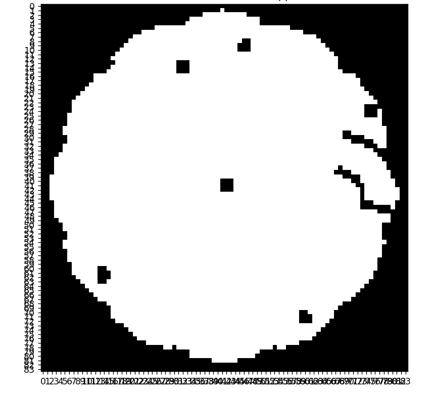

# Prioritized planning per risolvere istanze di MAPF
Questa repository contiene il codice implementato per eseguire l'algoritmo **Prioritized Planning** per risolvere istanze del problema **Multi-Agent PathFindinng(MAPF)**.
L’algoritmo prioritizza la pianificazione dei percorsi degli agenti in modo sequenziale, garantendo la generazione di soluzioni collision-free in maniera efficiente e veloce.
Si ricordi che il Prioritized Planning è un algoritmo che **non garantisce completezza** , dunque alcune istanze potrebbero non essere risolvibili.

## Conflitti gestiti 
I conflitti di cui si è tenuto conto sono:
- **Vertex Conflict**: quando due agenti si trovano nella **stessa cella** nello **stesso istante di tempo**.
- **Swapping Conflict**: quando due agenti si scambiano di posto percorrendo lo stesso arco in **direzioni opposte** nello stesso timestep.

## Visualizzazione mappa
Il progetto include anche un semplice modulo che permette di visualizzare la mappa scelta.

Ecco alcuni esempi di come appaiono le mappe.




## Animazione 
Il progetto include un modulo di **visualizzazione animata** del movimento degli agenti nel tempo.
Ogni agente ha un colore unico, e tale colore sarà presente anche :
  
  - nel **punto di partenza** dell'agente stesso (mostrato come **quadrato**).
  - nel **punto di arrivo** dell'agente stesso(indicato con una **X**).

## Benchmarks
Sono inclusi diversi **benchmark standard usati in AI**, per valutare:

- **Performance** al variare del numero di agenti.
- **Scalabilità** dell’algoritmo

Tali benchamrk si trovano nell'apposita cartella, dove viene esplicitato anche il link dove trovarne altri.

## Requisiti
Vengono qui elencate le librerie necessarie per garantire il corretto funzionamento del progetto.
- Python 3.7 o superiore
- Librerie Python:
  - **numpy**
  - **matplotlib**
  - **argparse**
    
E' possibile installare le suddette librerie tramite il comando:

 ```bash
pip install numpy matplotlib argparse
````` 
---
## Utilizzo
Per poter lanciare gli esperimenti è necessario eseguire il comando:
 ```bash
python main.py --map_path path/to/map.file --agent_counts 1,2,3 --show_map --show_animation
````` 

Viene fornita ora una spiegazione del comando:


-)**--map_path**(OBBLIGATORIO): si deve specificare il percorso della mappa che si intende testare


-)**--agent_counts**(OBBLIGATORIO): è una lista di valori interi che indica i vari agenti che si vogliono testare(nell'esempio 1, 2 e 3)


-)**--max_agent**(OPZIONALE,di default è 150): si deve inserire un valore intero che indica il massimo numero di agenti che si vuole generare nel pool


-)**--seed**(OPZIONALE,di default è 0): si deve indicare un valore intero necessario per la generazione del pool di agenti e per pseudorandomizzare le posizioni iniziali e obiettivo degli agenti


-)**--show_map**: è un flag opzionale per visualizzare la mappa


-)**--show_animation**: è un flag opzionale per visualizzare l'animazione, quindi il movimento degli agenti nel tempo

---
## Risultati
Al termine dell'esecuzione verranno generati grafici relativi a:


1)**tempo di esecuzione** al variare del numero di agenti


2)**numero dei nodi espansi** al variare del numero di agenti


3)**costo della soluzione**(somma delle lunghezze dei percorsi trovati) trovata al variare del numero di agenti

4)**tasso di successo** dell'algoritmo Prioritized Planning


4)tasso di successo e fallimento dell'algoritmo(si ricorda che PP non garantisce completezza)

---

